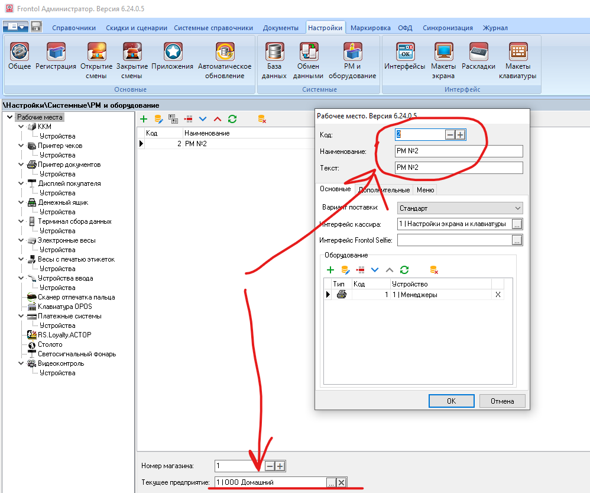

# Конвертер кассовых файлов из формата Пилот во Фронтол
Учетная система Домино 7.8 
Кассовая программа Фронтол 6 

## Оглавление

 [Цель проекта](#Цель-проекта)
 [Описание проекта](#Описание)
 [Ограничения](#Ограничения)
 [Номера касс](#Номера-касс)
 [Установка и запуск](#Установка-и-запуск)
 [Настройки Фронтол](#Настройки-Фронтол)
 [Миграция](#Миграция) 
 [TODO](#TODO)

## Цель проекта 

- Разрешительный режим для маркированного товара на кассах
- Оптимизация затрат на обслуживание и поддержку
- Внедрение системы лояльности
- Бесшовная интеграция, обеспечение одновременной работы старых и новых касс 

## Описание

Внешний обработчик файлов для кассы из формата Пилот в формат Фронтол

Программа конвертирует файлы из формата Пилот в формат Фронтол
Для каждой кассы существует своя папка в директории w:/MAIL/FOR_KAS/
по ее номеру, например w:/MAIL/FOR_KAS/**1**
сделать w:/MAIL/FOR_KAS/**1_FRONTOL** и конвертированные файлы складывать туда
из директории-источника, сконвертированное удалять

Учетная система Домино 7.8 ведет файловый обмен с кассами по формату Пилот 
(см. руководство интегратора) Передача товаров на кассу производится через меню
"Передать товар на кассу" из реестра переоценки / справочника
При попытке интеграции с Фронтол 6 поддерживаемый формат обмена 
имеет следующие ограничения:

- Формат устарел и похоже, что не поддерживается со стороны Фронтол
- В формате «PILOT» автоматическая загрузка данных невозможна. 
- Отсутствует поле для ставки НДС
- Отсутствует поле признака маркированного товара
- Кастомные поля ломают обмен

Преимущества использования конвертера:
- Обратная совместимость с уже существующими кассами, можно работать паралленьно
на старых и новых
- Гибкость, можно почти не дорабатывать выгрузку в Домино, настройки менять в скрипте 

[:arrow_up:Оглавление](#Оглавление)

## Ограничения
- Передача товара на кассы
    - Признак маркированного товара булевый, тег BMODE, требуется доработка Домино, чтобы номер типа товара туда транслировался
    - Фронтол из коробки не поддерживает уникальность штрихкода на одной карточке товара
- Прием данных с касс
    - Признак оплаты нал/безнал в секции CM, несовместимое поле
    - Отдел в секции CT, несовместимое поле

## Номера касс

1. Касса1 живая Пилот               - > Выбыла
2. Касса2 резерв Фронтол            - > живая Фронтол
3. Касса3 резерв тестовая Фронтол
4. Касса4 живая Пилот
5. Касса5 резерв Фронтол
6. Касса6 живая Пилот
7. Касса7 обмен с прайсчекером Пилот

[:arrow_up:Оглавление](#Оглавление)

## Установка и запуск

- На машине должен быть установлен Python 3.13
    - https://www.python.org/downloads/windows/
    - проверить: python --version  
    - путь питону Power Shell:
         Get-Command python | Select-Object -ExpandProperty Definition
- domino_frontol_for_kas_converter.py сам скрипт
    - в скрипте поправить пути для каждой кассы
    - пути к сетевым папкам абсолютные
    - создать директории куда конвертировать и для логов для каждой кассы
- frontol_converter_run.bat  
    - для каждой кассы свой, поправить пути для каждой кассы
    - поправить путь к питону 
    - запускать планировщиком раз в минуту
    - чтобы окно терминала запускалось в скрытом режиме:
        - выбрать опцию "Run whether user is logged on or not" 
        - установить опцию "Hidden" в настройках задачи
    - если надо чаще, смотрим в сторону библиотеки schedule

[:arrow_up:Оглавление](#Оглавление)

## Настройки Фронтол
    - Загрузить и установить локальный модуль Честный Знак
        - https://xn--80ajghhoc2aj1c8b.xn--p1ai/local-module/
        - режим не строгий
        - Получить в ЛК ЧЗ токен X-API-KEY (единожды)
    - Загрузить и установить Frontol Mark Unit
        - https://frontol.ru/resources/Download_Center/
    - Предприятие
    - Глобальный контроль 
    - Обмен

[:arrow_up:Оглавление](#Оглавление)

## Миграция 

- Настроить базовые параметры
- Загрузить кассиров
- Загрузить скидки
- Загрузить БД
- Настроить права кассирам

[:arrow_up:Оглавление](#Оглавление)

## TODO

- [ ] Кассиры доступ и прочее
    - [ ] Инкассация при закрытии смены
        драйвер - параметры ККТ - функция не поддерживается в нашей версии
    - [X] Шрифты четче
    - [ ] Шрифты крупнее
    - [ ] Печать копии выбранного чека
    - [ ] Реквизит RRN со слипа где брать?
    - [ ] Прикрутить логотип на дисплей покупателя
        - Настройки → Системные → РМ и оборудование → Дисплей покупателя

- [ ] Собрать требования к списку избранных товаров
- [ ] Собрать требования к списку товаров 18+
    - [ ] Добавить постфикс (18) к подгруппам с таким товаром
    - [ ] Настроить периодическую выгрузку (в идеале доработка экспорта Домино)

- [ ] Права сотрудников
    - [X] Запрос авторизации при недостатке прав
    - [X] Оплата 
        - [X] Оплата наличными (выключено по умолчанию)
            - [ ] Оплата по остатку    
            - [X] Оплата по введенной сумме  
        - [X] Оплата по банковской карте
            - [X] Несколько оплат
            - [X] Отмена оплаты
            - [X] Оплата по остатку    
            - [X] Оплата по введенной сумме 
        - [X] Пользовательская
            - [X] Несколько оплат
            - [X] Отмена оплаты
            - [X] Оплата по остатку    
            - [X] Оплата по введенной сумме 
          

- [X] Тестирование загрузка
    - [X] Загрузка - обычный товар 
    - [X] Загрузка - маркированный товар
    - [X] Загрузка - мерный товар 
    - [X] Загрузка - коэффициент штрихкода целый
        - Загрузка - коэффициент штрихкода дробный Домино не отдаёт такие
    - [X] Удаление штрихкода из карточки  
    - [X] Зарузка всей базы
    - [X] Дисконтные карты пакетом
    - [X] Загрузка - Отрицательная цена, ОК Фронтол не принимает такое
    - [X] Загрузка - классификаторы пакетом (Для кнопки Избранное и 18+)
        - Настройки - Макеты экрана - Рабочая панель 2 2018 1920x1080 - избранное 

- [ ] Тестирование регистрация
    - [ ] Пробить обычный товар
    - [ ] Вернуть обычный товар
    - [ ] Пробить мерный товар
    - [ ] Вернуть мерный товар
    - [ ] Пробить обычный товар как мерный - ждем ошибку
    - [ ] Вернуть старый товар по свободной цене (только ответственный)
    - [ ] Пробить маркированный товар
    - [ ] Пробить маркированный товар повторно - ждем ошибку    
    - [ ] Вернуть маркированный товар
    - [ ] Вернуть маркированный товар повторно - ждем ошибку
    - [ ] Автономный режим Пробить маркированный товар
    - [ ] Автономный режим Пробить маркированный товар повторно - ждем ошибку    
    - [ ] Автономный режим Вернуть маркированный товар
    - [ ] Автономный режим Вернуть маркированный товар повторно - ждем ошибку

- [X] Тестирование снятие касс
    - [X] бьет со склада CT поле 6 должно быть 4
         или заставить фронтол в 4ку или менять процедуру акцепта в Домино
         отшито в Домино, будет списывать всегда с 4го подразделения
    - [X] Бьется ли возврат? C поле 5 CT поле 11
    - [X] Скидки показвает? C поле 9 Номер карты обрезает фронтол, 
          номер карты показывает только в секции С, 
          8 знаков сначала видно, значащие 5 в конце отрезаны
    - [O] Нал/безнал?  CM поле 6 Не чинится, это код валюты, 
          по Пилотовскому формату Фронтол не отдаст как нам надо
    - [X] Проверить, не попадает ли этот код валюты в проводки какие          

- [ ] Доработки
    - [X] Весь товар грузится как мерный, разобраться с флагами 
    - [X] Запуск каждую минуту по шедулеру     
    - [X] Режим удаления штрихкодов
    - [X] Процесс ломается на кривых штрихкодах с запятой вида 
          код 350935 06000229868146E+25
          прогружается только половина файла и зависает в вечном цикле
          симптомы - из папки источника файл не удаляется, вылезло на всей базе
    - [X] Разобраться как грузить дисконтные карты вручную
    - [X] Доработать выгрузку из Домино, нужно получать тип маркированного товара
        - справочник в w:/PROJECT/volga2/CLASSIF/marktype.ini
    - [ ] Перепривязать прайсчекеры к фронтолу
    - [X] Очистить резервные папки от накопленного   
    - [ ] Перенос настроек БД с кассы на кассу как?       
    - [ ] Пофиксить работу фронтола с путями до сетевой папки Домино   

- [ ] Доработки 2й этап   
    - [ ] Подумать про мониторинг
    - [X] Проброс исходящего канала в сетевую папку
        -  Настройки - > Приложения - > При завершении работы
    - [X] Разобраться как грузить кассиров пакетом  
        - [X] Придумать пароли всем
        - !!! ! Внимание! Пароли в явном виде, надо удалять обработанный файл загрузки
        - Зачем кассиру ИНН и нужно ли заполнять это поле?
            https://www.nalog.gov.ru/rn77/about_fts/docs/10020801/
            не обязательный реквизит
    - [X] Разобраться как грузить дисконтные карты пакетом
    - [X] Разобраться как грузить классификаторы пакетом (для избранного и 18+)    
    - [ ] Контроль задвоенных штрихкодов на кассе, как? Firebird допилить?
    - [ ] Контроль размера папок лога и обработанных файлов Фронтола  

[:arrow_up:Оглавление](#Оглавление)